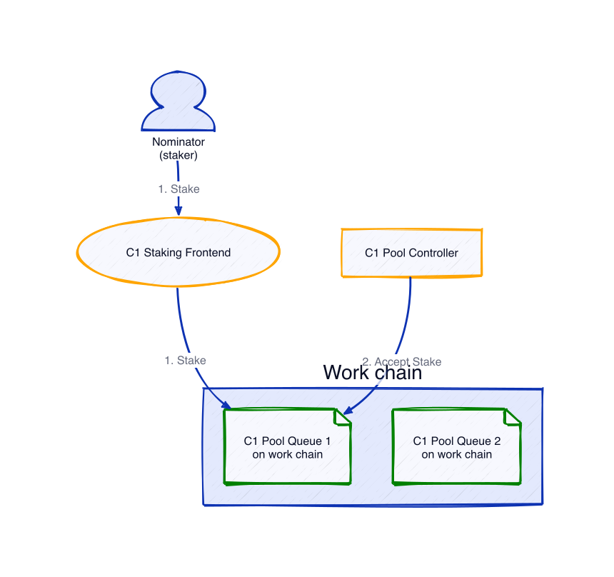
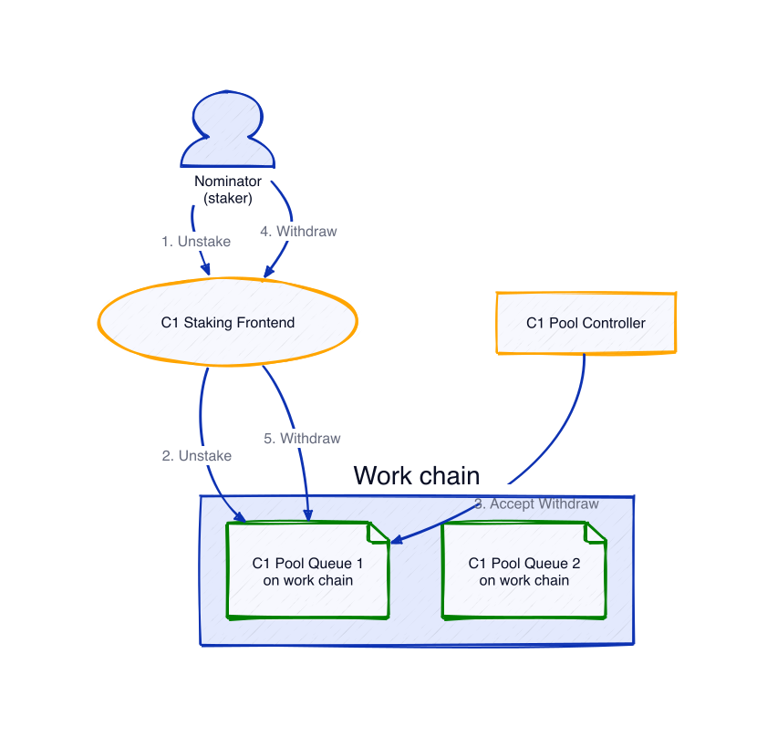
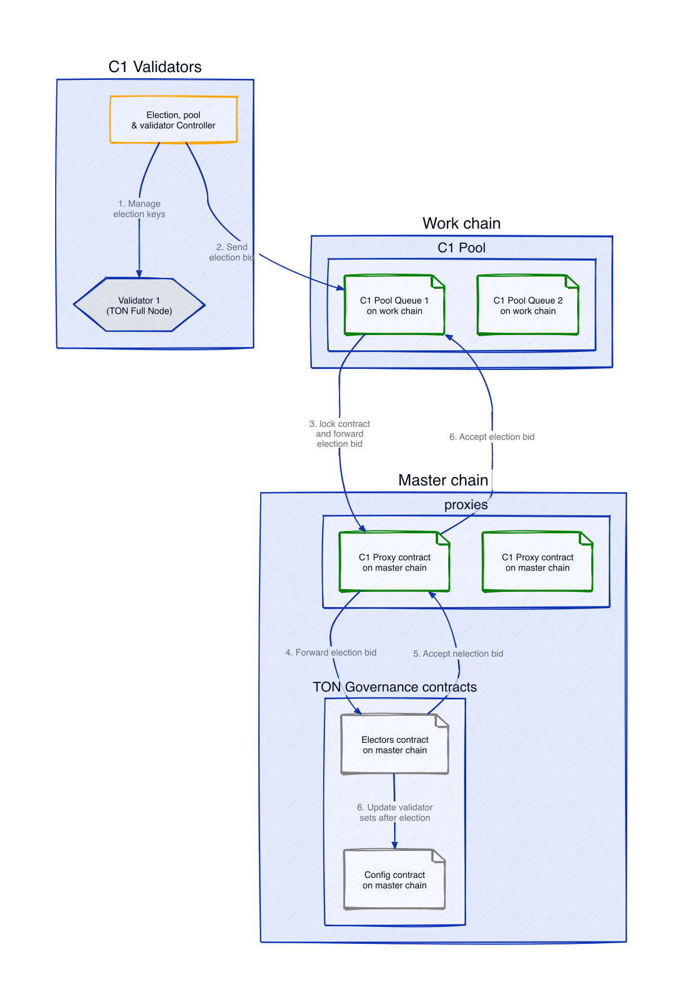
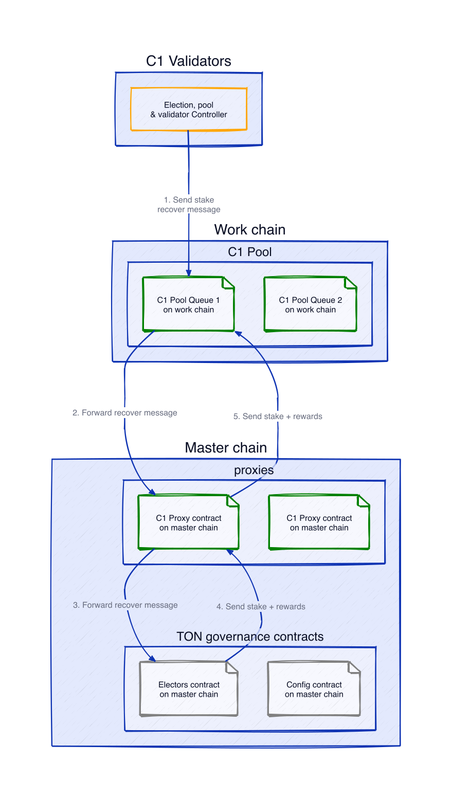

# TON Pool: Architecture

**TON Pool** provides efficient staking solution on the TON blockchain by utilizing the two-queue smart contract system from the [TON Whales](https://tonwhales.com/) project. 
By using two queues, the TON Pool ensures optimal resource use and enables 100% validator efficiency (With a single queue, double the number of validators would be needed).

To support these smart contracts, **TON Pool** employs a set of controllers that run directly on the node. These include the **Pool Controller** for managing customer interactions, the **Election Controller** for validator participation, and the **Validator Controller** for secure key management. Together, they enable efficient staking and ensure secure, reliable performance across each validation cycle.

## Controllers

The solution includes several key components for managing staking workflows:

- **Pool controller**: Responsible for accepting stakes and withdrawals from customers.
- **Election controller**: Responsible for participating in validator elections to get our
  validators into the top 100 validator list. This controller interacts with the Validator Controller to secure the necessary public keys.
- **Validator controller**: Responsible for generating new key pairs for each election and
  integrating with the TON validator software on each individual validator.
  
The **Pool** and **Election controllers** can be run together in the same binary, this makes it easier to accept stakes and withdrawals before we start participating in an election.

## Validators

Validators, as full nodes, automatically start validating when their public key is included in the current validator set. This information is retrieved from the Elector contract or Chain Config. The pool and election controllers run independently of the validators.

The [validation cycle](https://tonscan.com/validation) is split into **odd** and **even** cycles. Each cycle has four phases:

  - **Election**: 6-7 hours
  - **Delay**: 2-3 hours
  - **Validation**: 18 hours
  - **Hold**: 9 hours (overlaps with the Election phase of the next cycle)

## Workflows

**TON Pool** includes four main workflows using the TON Whales Pool contract:

1. **Staking**: Customers deposit TON to the pool contract.
2. **Unstaking**: Customers withdraw TON from the pool contract.
3. **Stake Submission**: Validator bids are sent to participate in the upcoming election.
4. **Stake Retrieval**: Previous bids and rewards are reclaimed from the last validation cycle.

### Staking

1.	A customer submits a stake message to the Pool contract through the **TON Pool** frontend, which adds the deposited TON as a pending stake.
2.	At the start of the next election cycle, when the pool unlocks, the controller processes the pending stake. Only one contract can accept new stakes during each cycle, determined by alternating between contracts.
  - The controller first checks both contracts’ statuses to identify which one has ProxyStakeAt set to 0, indicating it can accept stakes.
  - It then verifies if there are pending deposits for this contract. If so, the pool contract processes these deposits by sending an acceptance message.

### Unstaking

1.	**Unstake Request**: Customers initiate an unstake request through a **TON Pool** frontend.
  - If the contract is **unlocked**, customers receive their full stake immediately.
  - If the contract is **locked**, they receive as much of their stake as possible based on the available balance in the Pending Stake. Any remaining amount is added as a pending request.
2.	**Processing Pending Withdrawals**: The controller processes any pending withdrawals at the start of the next election cycle.
3.	**Final Withdrawal**: Once processed, customers can retrieve any remaining stake by sending another withdrawal request.

### Stake Submission

This process occurs every other cycle for each **TON Pool** contract.

1.	The Validator Controller generates validator keys for the next election.
2.	The Election Controller creates and sends an election bid to the Pool contract.
3.	The Pool contract processes and forwards the bid to the proxy contract, locking the pool.
4.	The Proxy contract submits the bid to the Elector contract.
5.	The Elector contract approves or rejects the bid 
6. The Elector contract updates the Config contract with the new validator set after elections.

### Stake Retrieval

This process also occurs every other cycle for each **TON Pool** contract.

1.	The Election Controller sends a recover stake message to the Pool contract.
2.	The Pool contract relays this message to the Elector contract through the proxy.
3.	The Elector contract returns the stake and rewards to the pool through the proxy.

## Efficient On-Chain Operations

To optimize gas costs, all main operations are consolidated to occur once per election cycle:

-	Stake and withdrawal actions are processed once per election cycle.
-	Election bids (stake bids) are placed once per cycle.
-	This approach includes tracking the long-term ADNL key for election bids and generating election keys once per cycle.
-	Stake and reward retrieval are also conducted once per cycle.

  
## Further Reading

- [TON Docs](https://docs.ton.org/develop/overview)
- [TON Whales contract](https://github.com/tonwhales/ton-nominators/)
- [FunC standard library](https://docs.ton.org/develop/func/stdlib)
- [TVM exit codes](https://docs.ton.org/learn/tvm-instructions/tvm-exit-codes)
- [TL-B (Type Language - Binary) definitions](https://github.com/ton-blockchain/ton/blob/master/crypto/block/block.tlb)
- [TON Elector contract](https://github.com/ton-blockchain/ton/blob/master/crypto/smartcont/elector-code.fc)
- [TON Config](https://tonviewer.com/config)
- [Validation Cycle Live](https://tonscan.com/validation)
