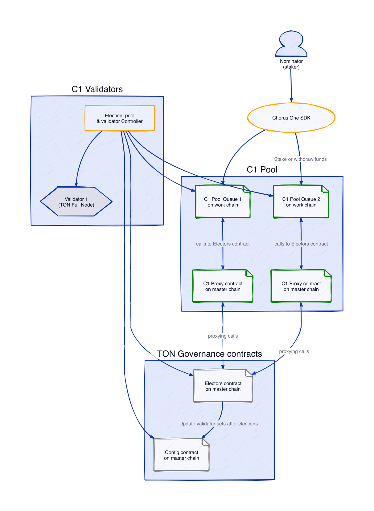

# TON Pool: Overview

The **TON Pool** is the most accessible and flexible staking solution, designed for users of all sizes with a low minimum stake of just 10 TON. It supports unlimited delegators, automates staking management, and offers partial withdrawals for convenience. Easy to use and scalable, it's the go-to option for most staking needs.

The **Chorus One SDK** simplifies this process by providing developers with the tools needed to build, sign, and broadcast staking transactions.



**Compatibility Notice**

The methods provided in this documentation are compatible with popular TON libraries such as `@ton/ton`. This compatibility ensures that you can seamlessly integrate these methods into your existing TON projects.



## Understanding Key Concepts


### Battle-Tested TON Whales Contracts

The **TON Pool** is powered by [TON Whales contracts](https://tonwhales.com/), a robust and proven technology that has operated reliably in the TON ecosystem for several years. These contracts have been tested extensively in real-world conditions, providing a solid foundation for secure and efficient staking operations.






**Architecture Overview**

To learn more about the architecture of the TON Pool and the underlying TON Whales contracts, refer to the [Architecture](architecture.md) section.




## Two Validator Pool Addresses

To ensure uninterrupted network participation, TON Pool utilizes two validator pool addresses: one for odd cycles and another for even cycles. These pools alternate between cycles to enable seamless staking and validation without downtime. This design ensures continuous operation and smooth participation in the TON blockchain’s validation process.

When using the **Chorus One SDK**, you must provide a pair of validator addresses (odd and even) when configuring your staking transactions. This ensures your staked assets are properly integrated into the network’s alternating validation mechanism.

## Setting Up the Staker

To get started with staking on TON using the Chorus One SDK, you will first need to initialize the SDK.

- **Note:** For testing purposes we will be using the TON testnet.

First, create an instance of `TonPoolStaker` with the following configuration:

```javascript
import { TonPoolStaker } from '@chorus-one/ton'

const staker = new TonPoolStaker({
  rpcUrl: 'https://testnet.toncenter.com/api/v2/jsonRPC'
})
```

**Configuration Parameters**:

- **rpcUrl**: The URL of the TON RPC endpoint. This is where the SDK will connect to interact with the network. In this example, we are using a public endpoint for the testnet.

---

## Initializing the Staker

After configuring the `TonPoolStaker`, you can initialize it to prepare for staking operations.

This can be done via the following input:

```javascript
await staker.init()
```

The `init` method establishes a connection with the configured RPC endpoint and prepares the staker for operations such as building and broadcasting transactions.

---

## Building Transactions

Once the staker and signer are set up, you can start building transactions for staking operations.

The `TonPoolStaker` class provides methods to build transactions for staking, unstaking, and wallet deployment.

- You can learn more about these methods in the [Methods](methods.md) section.

**Example of building a single nominator pool staking transaction:**

```javascript
const { tx } = await staker.buildStakeTx({
  validatorAddressPair: [
    'kQAHBakDk_E7qLlNQZxJDsqj_ruyAFpqarw85tO-c03fK26F',
    'kQCltujow9Sq3ZVPPU6CYGfqwDxYwjlmFGZ1Wt0bAYebio4o'
  ],
  amount: '2', // 2 TON
})
```

---

## Getting the Validators Pair Address provided by Chorus One

The `@chorus-one/ton` module includes Chorus One validator pairs for the  chains, organized by network(mainnet or testnet). You can use these addresses when building transactions.

```javascript
import { CHORUS_ONE_TON_VALIDATORS } from '@chorus-one/ton'

const validatorAddressPair = CHORUS_ONE_TON_VALIDATORS.testnet.tonPoolPair
console.log(vaultAddressPair)
// [
//    'kQAHBakDk_E7qLlNQZxJDsqj_ruyAFpqarw85tO-c03fK26F',
//    'kQCltujow9Sq3ZVPPU6CYGfqwDxYwjlmFGZ1Wt0bAYebio4o'
// ]
```


---

## Signing the Transaction

Once the transaction is built, you can sign that transaction using your own signing solution e.g.:

```js
const signedTx = await yourWallet.signTransaction(tx)
```

Additionally, you can use the Chorus One SDK to sign transactions using Fireblocks, mnemonic or other methods.

- For detailed information on setting up and configuring these options, please refer to the [What is a Signer?](../../signers-explained/what-is-a-signer.md) section.



By integrating Fireblocks you can leverage its robust security features to sign transactions on the TON network. To set up Fireblocks, you must provide the necessary API key, secret key, and vault ID.

Example shown below:

```javascript
import { TonPoolStaker } from '@chorus-one/TON'
import { FireblocksSigner } from '@chorus-one/signer-fireblocks'

const signer = new FireblocksSigner({
  apiSecretKey: 'your-api-secret-key',
  apiKey: 'your-api-key',
  vaultName: 'your-vault-name',
  assetId: 'TON_TEST',
  addressDerivationFn: TonPoolStaker.getAddressDerivationFn()
})

await signer.init()

const { signedTx } = await staker.sign({
  signer,
  signerAddress: '0QDsF87nkTYgkvu1z5xveCEGTRnZmEVaVT0gdxoeyaNvmoCr',
  tx
})
```

For more information please refer to the [Signing with Fireblocks](../../../signers-explained/fireblocks.md)



---

## Broadcasting the Transaction

After signing the transaction, you will need to broadcast it to the network. You can do this using the `broadcast` method:

```javascript
const txHash = await staker.broadcast({ signedTx })
```

And now you can track the transaction status:

```javascript
const { status, receipt } = await staker.getTxStatus({
  address: '0QDsF87nkTYgkvu1z5xveCEGTRnZmEVaVT0gdxoeyaNvmoCr',
  txHash
})

console.log(status) // 'success'
```

---

## Next Steps

In this section you learned how to set up the Chorus One SDK for the TON network using the TON testnet, which included how to build staking transactions, sign, broadcast, and track them.

- To learn more about the available methods on `TonPoolStaker`, continue to the [Methods](methods.md) section.

## Further Reading
- [TON Pool Architecture](architecture.md)
- [TonPoolStaker API Reference](../../../docs/classes/ton_src.TonPoolStaker.md)
- [What is a Signer?](../../../signers-explained/what-is-a-signer.md)
