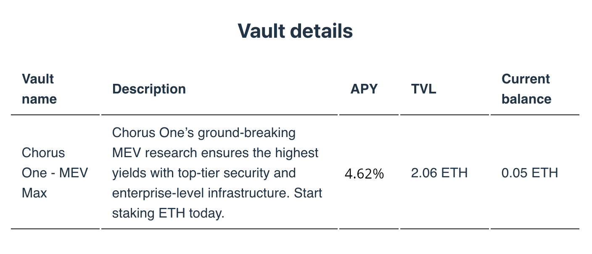

## Overview

In this section, we will explore how to fetch and display vault details using the Chorus One SDK.

This process involves initializing the SDK, fetching the vault details, and presenting them in a user-friendly format.

## Initializing the SDK and Fetching Vault Details

First, we start by initializing the SDK like we did previously. Then, we use the `getVault` method to fetch details about the vaults.

**Here’s a snippet illustrating this process:**

```javascript
import { EthereumStaker, CHORUS_ONE_ETHEREUM_VALIDATORS } from '@chorus-one/ethereum'

const staker = new EthereumStaker({ network: 'hoodi' })
await staker.init()

const validatorAddress = CHORUS_ONE_ETHEREUM_VALIDATORS.ethereum.maxVault
// Alternatively, you can define vaults yourself:
// const vault = '0x...';

// Note: The getVault method accepts an array of vault addresses.
const vault = await staker.getVault({ validatorAddress })

console.log(vault)
// {
//   address: "0x95d0db03d59658e1af0d977ecfe142f178930ac5",
//   name: "Chorus One Test Wallet",
//   description: "Test wallet for Chorus",
//   logoUrl: "https://storage.stakewise.io/dxepxhzxsrqs.png",
//   tvl: 5600841037682025178745n,
//   apy: "3.98146836137682602839366230181093629",
// }
```

The `Vault` object returned by `getVault` contains the following parameters:

- **`address` (Hex)**: The hexadecimal address of the Vault.
- **`name` (string)**: A human-readable identifier for the Vault.
- **`description` (string)**: A description of the Vault.
- **`logoUrl` (string)**: The URL of the Vault’s logo for UI display.
- **`tvl` (bigint)**: The total value of assets locked in the Vault, expressed in wei.
- **`apy` (string)**: The average yield percentage derived from historical data.

## Displaying Vault Details as a Table

Now, let’s display these vault details in a table format in the UI.

```javascript
import { formatEther } from 'viem';
import { Vault } from '@chorus-one/ethereum';

const Vault = ({ vaultDetails }: { vaultDetails: Vault[] }) => {
   return (
     <table>
        <thead>
           <tr>
             <th>Vault name</th>
             <th>Description</th>
             <th>APY</th>
             <th>TVL</th>
           </tr>
        </thead>
        <tbody>
           {vaultDetails.map((vault: Vault) => (
             <tr key={vault.name}>
                <td>{vault.name}</td>
                <td>{vault.description}</td>
                <td>{vault.apy * 100} %</td>
                <td>{vault.tvl} ETH</td>
             </tr>
           ))}
        </tbody>
     </table>
   );
};
```

Once rendered, the vault details will be displayed in an informative table on the screen, showcasing key information such as vault name, APY, and balances in user-friendly format:



## Next Steps

In this section, we learned how to fetch and display details of a vault using the Chorus One SDK. To continue exploring the functionality of the SDK, you can proceed to the next section: [Staking][stake].

[stake]: 3-staking.md
