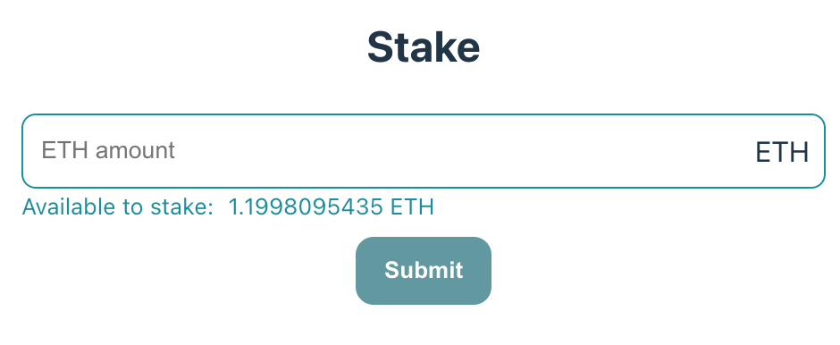

## Overview

Staking is a core functionality of the **Chorus One SDK**, enabling users to lock their ETH to support network operations and earn rewards.

This section will cover how to integrate staking into your application by creating a form which submits the transaction.

## The Form Component

We will start by creating a basic form which consist of an input field for the amount to be staked and a button to submit the transaction.

**Below is an implementation of this form in React:**

```typescript
import React, { useState } from 'react';
import { useAccount, useBalance } from 'wagmi';

export const FormComponent = ({ onSubmit }) => {
   const { address } = useAccount();
   const { data: balance } = useBalance({
     address,
   });
   const [inputValue, setInputValue] = useState('');

   return (
     <div>
        <form onSubmit={(e) => {
           e.preventDefault();
           onSubmit(inputValue);
           setInputValue('');
        }}>
           <input
             type="text"
             placeholder="ETH amount"
             onChange={(e) => setInputValue(e.target.value)}
             value={inputValue}
           />
           <span>ETH</span>
           <div>Available to stake: {balance?.formatted} ETH</div>
           <button type="submit">Submit</button>
        </form>
     </div>
   );
};
```

This form component uses the `useAccount` and `useBalance` hooks from `wagmi` to manage user account details and balance information. The `onSubmit` prop is a function that handles the actual staking process, which you can define in your application logic.

This simple yet effective form provides the basic functionality to integrate staking into your Ethereum-based application.



## Writing the Staking Transaction Function

Now, we will focus on the main operation of our application: submitting a staking transaction.

**Below is a representative snippet of the function:**

```typescript
const stake = async ({
  userAddress, // Comes from wagmi
  walletClient, // Comes from wagmi
  network, // Networks.Holesky
  vault, // Vault address (can be provided by getDefaultVaults(...))
  amountToStake // Amount of ETH to deposit as string
}: {
  userAddress: Hex
  walletClient: ReturnType<typeof useWalletClient>['data']
  network: Networks
  vault: Hex
  amountToStake: string
}): Promise<Hex> => {
  const staker = new EthereumStaker({ network: 'holesky' })
  await staker.init()

  const validatorAddress = CHORUS_ONE_ETHEREUM_VALIDATORS.ethereum.mevMaxVault

  const { tx: stakeTx } = await staker.buildStakeTx({
    delegatorAddress: userAddress,
    validatorAddress,
    amount: amountToStake // Passed as string, e.g. '1' - 1 ETH
  })

  console.log(stakeTx)
  // {
  //   to: "0x...",
  //   data: "0x...",
  //   value: 10000000000000000n
  // }

  const request = await walletClient.prepareTransactionRequest(stakeTx)

  await walletClient.sendTransaction(request)
}
```


**Delegation Tracking**

If you would like to learn how to track and attribute staking transactions to
specific sources, such as marketing campaigns or integration partners, refer to the [Delegation Tracking](../build-your-staking-dapp/ethereum/delegation-tracking.md) section.




The `Transaction` object returned by `buildStakeTransaction` includes the following parameters:

- **`to` (Hex)**: The address of the contract to interact with(the vault address).
- **`data` (Hex)**: A contract hashed method call with encoded arguments (the transformation of the method call into this encoded and hashed form is handled by the `encodeFunctionData` method from the viem library).
- **`value` (bigint)**: The amount of ETH being used in the transaction. In this case, it's the amount being staked.

### Ensuring Correct Amount Format for Staking

The `amountToStake` parameter must be a string representing the amount of ETH to deposit. For example, `'1'` represents 1 ETH.

If you have the amount as a `bigint`, convert it to a string using the `formatEther` function from `viem`. Example:

```typescript
import { formatEther } from 'viem'

const amountBigInt = 10000000000000000n // 0.01 ETH
const amountToStake = formatEther(amountBigInt)

console.log(amountToStake) // "0.01"
```

This ensures the `amountToStake` parameter is in the correct format for the staking transaction function.


**Configuring Fees**

We utilize here the Ethereum Improvement Proposal 1559 (EIP-1559) transaction type. With EIP-1559, users specify two types of fees:

- **`maxFeePerGas`**: The maximum fee per gas the user is willing to pay. This includes the base fee and the priority fee.
- **`maxPriorityFeePerGas`**: Also known as the tip, this incentivizes miners to prioritize the transaction.

The network determines the actual fee based on the current demand for block space and the transaction's priority. To estimate the gas required for the transaction, we use the `prepareTransactionRequest` method from the `viem`'s wallet client.

For detailed information on configuring fees, please refer to the [Viem Documentation](https://viem.sh/docs/chains/fees).



## Next Steps

Having integrated the basic staking functionality into your application, you're now ready to expand its capabilities.

To continue exploring our application's functionality, you can proceed to the next section: [Unstaking][unstake].

[unstake]: 4-unstaking.md
