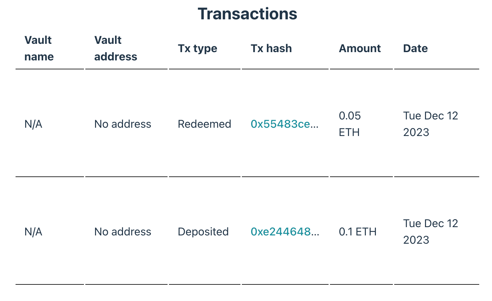

## Overview

Tracking the transaction history of your vaults is important for accountability and to understand user staking, unstaking, minting, and other activities. With the Chorus One SDK, you can fetch detailed transaction history which includes up to 1,000 transactions associated with a given vault.

This section will guide you through fetching and displaying this transaction history.

## Initializing the Staker and Fetching Transaction History

To start, we need to initialize the `EthereumStaker` in the same manner as we did previously. Then, we'll use the `getTxHistory` method provided by the SDK to retrieve the transaction history.

**Here's how you can write the code snippet for this process:**

```typescript
const staker = new EthereumStaker({ network: 'holesky' })
await staker.init()

const txHistory = await staker.getTxHistory({
  delegatorAddress: userAddress,
  validatorAddress
})

console.log(txHistory)
// [
//   {
//     timestamp: 1632960000000,
//     type: 'Deposited',
//     amount: '1',
//     txHash: '0x...'
//   }
// ]
```

The `getTxHistory` method returns an array of transaction objects. Each of these objects contains details about individual transactions.

**Here's a breakdown of the parameters in a `VaultTransaction` object:**

- **`timestamp` (number)**: The timestamp of the transaction.
- **`type` (VaultActionType)**: The type of transaction, which can be `Deposit`, `Redeem`, etc.
- **`amount` (string)**: The amount of Ethereum transacted.
- **`txHash` (Hex)**: The unique hash identifier of the transaction.



The `VaultActionType` union includes the following types of transactions:
**`Redeemed`**, **`Deposited`**, **`VaultCreated`**, **`OsTokenMinted`**, **`OsTokenBurned`**, **`OsTokenRedeemed`**, **`OsTokenLiquidated`**, **`ExitedAssetsClaimed`**, **`Migrated`**



## Displaying Transaction History

After fetching the transaction history, we will display it in a structured table format.

**Here's the code snippet for the transaction history table:**

```typescript
import { formatEther } from 'viem';

const Transactions = ({ transactions }) => {
  return (
    <table>
      <thead>
        <tr>
          <th>Transaction Type</th>
          <th>Transaction Hash</th>
          <th>Amount</th>
          <th>Date</th>
        </tr>
      </thead>
      <tbody>
        {transactions.map((transaction, index) => {
          const { vault } = transaction;
          const type = transaction.type ?? 'No Type';
          const date = transaction.timestamp
            ? new Date(transaction.timestamp).toLocaleDateString()
            : 'No Date';
          const hash = transaction.txHash;

          return (
            <tr key={index}>
              <td>{type}</td>
              <td>
                <a href={`https://holesky.etherscan.io/tx/${hash}`}>{hash}</a>
              </td>
              <td>{transaction.amount} ETH</td>
              <td>{date}</td>
            </tr>
          );
        })}
      </tbody>
    </table>
  );
};
```

The `Transactions` component function takes an array of transaction objects and renders them in a table. Each transaction's details, including the vault name, address, transaction type, hash, amount, and date, are neatly displayed. Transaction hashes are linked to Etherscan for easy tracking.

**Once rendered, the transaction history will be displayed in an informative table on the screen:**



## Next Steps

In this section, we learned how to fetch transaction history using the `getTransactionsHistory` method and displayed it in a structured table format.

Next, we will fetch the vault rewards history and draw its chart. Please proceed to the [Rewards History][rewards-history] section to continue.

[rewards-history]: ./8-rewards-history.md
