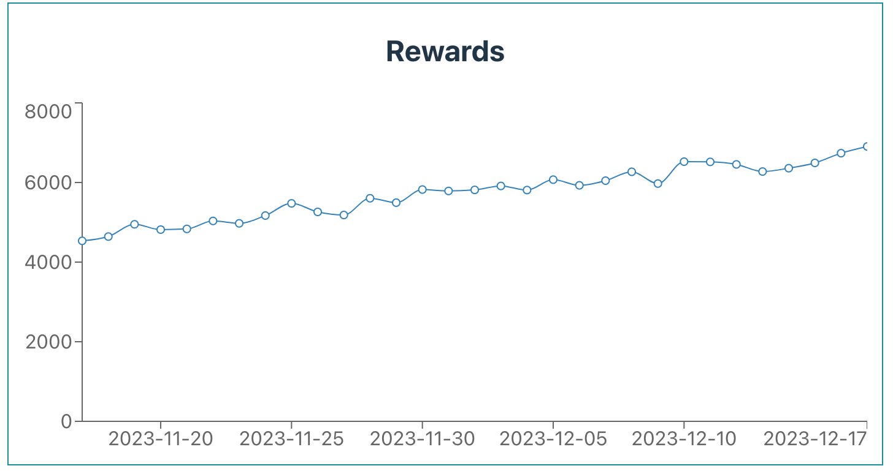

## Overview

In this section, we'll explore the process of fetching and visualizing rewards history using the Chorus One SDK. Visualizing reward data helps users gain insights into their earnings over time and make informed decisions about their staking activities.

We will guide you through fetching the necessary data, and presenting it in a user-friendly chart.

## Initializing the Pool and Fetching Rewards History

As with our previous tasks, we begin by initializing `EthereumStaker`. Then, we'll use the `getRewardsHistory` method to gather the rewards history.

**Below is a sample code snippet for fetching rewards history:**

```typescript
const staker = new EthereumStaker({ network: 'holesky' })
await staker.init()

// Setting the date range: from 1 month ago to today
const from = new Date()
from.setMonth(from.getMonth() - 1)
const to = new Date()

const rewardsHistory = await staker.getRewardsHistory({
  startTime: from.getTime(),
  endTime: to.getTime(),
  delegatorAddress: userAddress,
  validatorAddress
})
```

The `getRewardsHistory` method requires an object with the following parameters:

- **`startTime` (number)**: The start time in milliseconds.
- **`endTime` (number)**: The end time in milliseconds.
- **`delegatorAddress` (Hex)**: The user address for which to retrieve rewards history.
- **`validatorAddress` (Hex)**: The vault address from which to retrieve rewards history.

The method returns an array of `RewardsDataPoint` objects, each containing:

- **`timestamp` (number)**: The timestamp of the rewards transaction.
- **`amount` (string)**: The amount of rewards received in ETH.

## Visualizing Rewards Data with a Chart

We will use a chart to provide a visual representation of the rewards. We have chosen to use [Recharts][recharts], a composable library built on React components for this guide. However, feel free to use any other charting library that suits your needs.

**First, we'll transform the rewards history data into a format suitable for Recharts:**

```typescript
const chartData = rewardsHistory.map((point) => {
  return {
    date: new Date(point.timestamp).toDateString(),
    amount: Number(point.amount)
  }
})
```

In this transformation, each rewards data point is converted into an object with `date` and `amount` properties, where `date` is a string representation of the date, and `amount` is the reward amount in Ether.

**Here's the code snippet for creating a line chart with our rewards data:**

```typescript
import { LineChart, Line, XAxis, YAxis } from 'recharts';

type ChartDataPoint = {
    amount: number;
    date: string;
};

const RewardsChart = ({ data }: { data: ChartDataPoint[] }) => {
    return (
        <LineChart width={700} height={300} data={data}>
            <XAxis dataKey="date" />
            <YAxis />
            <Line type="monotone" dataKey="amount" />
        </LineChart>
    );
};
```

In this snippet, we import the necessary components from Recharts and define the `RewardsChart` component. This component takes an array of `ChartDataPoint` objects and renders them in a LineChart.

The `XAxis` and `YAxis` components provide the chart's axises, while the `Line` component plots the transaction amounts over time.

## Chart Representation on the Screen

Once rendered, the line chart provides a clear view of reward history over time.



# Wrapping Up

Throughout this guide, we explored the powerful capabilities of the Chorus One SDK, unlocking its potential for various key operations.

We started by setting up the SDK and quickly moved into practical tasks like fetching and displaying vault details. From there we explored staking and showing how to lock ETH seamlessly and earn rewards.

Next, we covered the process of minting osETH tokens to maintain liquidity and the essential steps to burn osETH tokens and reclaim your staked ETH.

Our step-by-step instructions made unstaking your ETH and navigating the exit queue a breeze, highlighting the user-friendly nature of the Chorus One SDK.

We also covered how to track transaction history for a given vault, giving you clear insights into all your staking, unstaking, and other activities.

Lastly, we wrapped up by visualizing the rewards history, helping you understand the benefits accrued from the vault.

By the end of this guide, you should feel confident in leveraging the Chorus One SDK to enhance your Ethereum-based applications. Happy staking! 📥



For more detailed information on the Chorus One SDK, visit the [API Documentation][api] to explore all available methods and their usage.



[recharts]: https://recharts.org
[api]: ../docs/classes/ethereum_src.EthereumStaker.md
