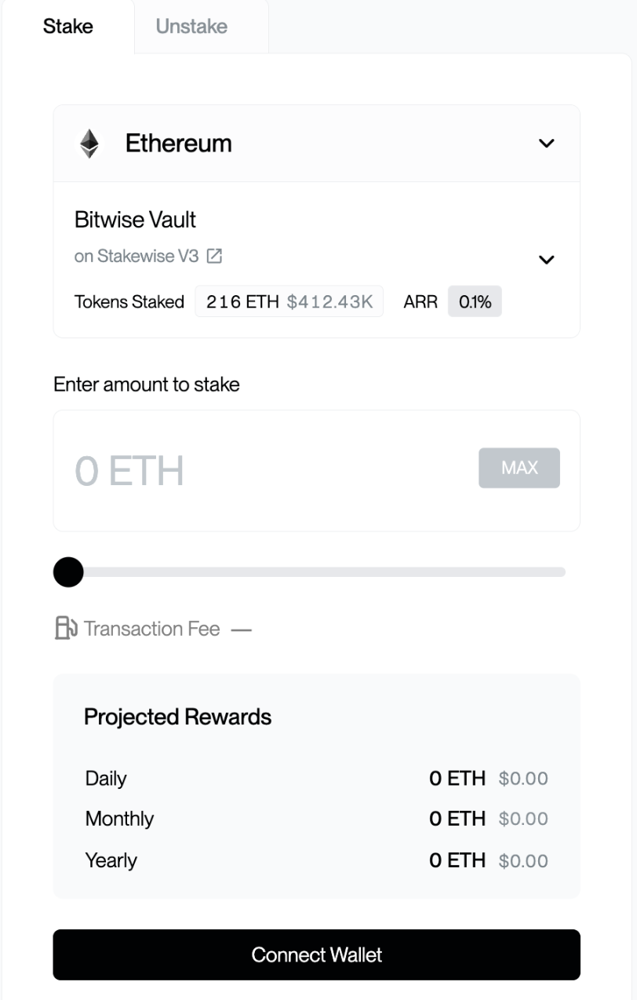

# How to Stake

Staking through the dApp takes three steps: the staker connects a wallet, enters an amount, and approves the transaction in their wallet. The flow is the same for ETH, SOL, and GRAM; only the wallet and network differ.

The dApp is at [staking.chorus.one](https://staking.chorus.one/eth/stake).

## Step 1: Connect a wallet

On the stake page, the staker selects **Connect Wallet** and chooses a wallet:

* For **ETH**, an Ethereum wallet (MetaMask, Phantom, WalletConnect, or a hardware wallet).
* For **SOL**, a Solana wallet.
* For **GRAM**, a TON-compatible wallet.

When the dApp runs inside a supported host with an approved WalletProfile (for example an embedded wallet or custody platform), it connects to the staker's active account automatically, skipping this step. See the [Integration guide](./integration-guide.md) for details.

<!-- TODO(screenshot): Connect Wallet dialog, not yet captured (the staging session auto-connects a wallet, so the connect dialog isn't reachable without disconnecting). Capture from a fresh/disconnected session, save to book/.gitbook/assets/staking-dapp-connect-wallet.jpg, then uncomment.
<figure><figcaption>
Connecting a wallet
</figcaption></figure>
-->

## Step 2: Enter the amount to stake

The staker selects the asset, enters the amount to stake, and reviews the details shown: estimated rewards and any network fees.

ETH has no minimum; SOL and GRAM have small minimum stake amounts, which the dApp displays before the staker confirms.

<!-- Reusing the overview/stake screenshot here for now; replace with a dedicated amount-entry capture later. -->
<figure><figcaption>
The stake screen (test environment; all figures shown are test data)
</figcaption></figure>

## Step 3: Approve the transaction

The staker selects **Stake** (or **Confirm and Stake**). Their wallet prompts them to review and sign the transaction; confirming it broadcasts the stake to the network.

Once the transaction is confirmed on-chain, the position is active and begins accruing rewards. The staker can review their staked balance and rewards in the dApp dashboard at any time.

For institutional stakers and platform partners, detailed multi-network reward reporting, historical data, and exports are available via the [Rewards Dashboard](../chorus-one-rewards.md).

<!-- TODO(screenshot): Wallet confirmation / success screen, not yet captured (requires signing a live stake transaction). Capture during a real staking flow, save to book/.gitbook/assets/staking-dapp-stake-success.jpg, then uncomment.
<figure><figcaption>
Transaction success
</figcaption></figure>
-->


That completes a stake. For exiting a position later, see [Unstaking &#x26; Withdrawing](./unstaking-and-withdrawing.md).


## Staking targets & audits

Each asset stakes to a published, verifiable target:

* **ETH: StakeWise V3 vault contracts.** Source and audit reports are published in the StakeWise V3 core repository: [github.com/stakewise/v3-core/audits](https://github.com/stakewise/v3-core/tree/main/audits).
* **SOL: native validator.** SOL is staked natively to our Solana validator, viewable on [Solana Beach](https://solanabeach.io/validator/Chorus6Kis8tFHA7AowrPMcRJk3LbApHTYpgSNXzY5KE).
* **GRAM: TON Pool.** Contract source and the 2025 Cantina audit report are published at [github.com/ChorusOne/tonpool](https://github.com/ChorusOne/tonpool).


The live contract and validator addresses can also be verified against the **FAQ** section inside the dApp at [staking.chorus.one](https://staking.chorus.one/eth/stake) before interacting with them directly.

