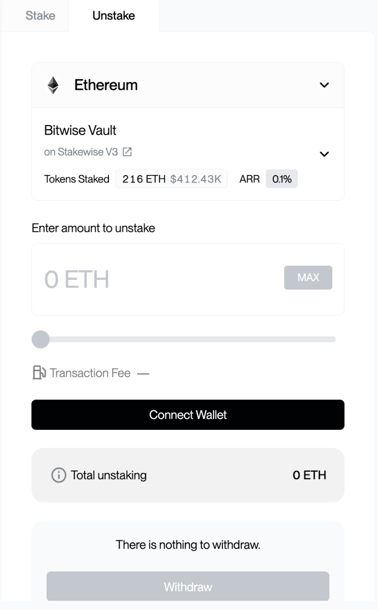

# Unstaking & Withdrawing

Unstaking returns a staker's assets to their wallet. It is a two-part process on every network: the staker first requests to unstake, then withdraws once the funds are available. As with staking, every transaction is signed in the staker's own wallet.

The dApp is at [staking.chorus.one](https://staking.chorus.one/eth/stake); the staker opens the dashboard for the asset they want to unstake.

## Step 1: Request unstake

The staker connects the wallet holding the staked position, selects the asset, and enters the amount to unstake. Selecting **Unstake** and approving the transaction in the wallet submits the request.

Depending on the network, the assets may enter a short exit or unbonding window before they can be withdrawn.

<figure><figcaption>
Requesting an unstake (test environment; all figures shown are test data)
</figcaption></figure>

Exit timing depends on each network's own unbonding/withdrawal mechanics and current conditions. As a guide:

<table><thead><tr><th>Asset</th><th>Typical time to withdrawable</th></tr></thead><tbody><tr><td><strong>ETH</strong></td><td>At least 24 hours, and up to the length of the network's active exit (unstake) queue.</td></tr><tr><td><strong>SOL</strong></td><td>2–3 days (one full epoch)</td></tr><tr><td><strong>GRAM</strong></td><td>Approximately 36 hours</td></tr></tbody></table>


The dApp shows the status of the request and when funds become available to withdraw.


## Step 2: Withdraw to the wallet

Once the unstake request has cleared and the funds are marked as available, the staker returns to the dApp, selects **Withdraw**, and approves the withdrawal transaction in the wallet.

The assets are then returned to the staker's connected wallet address.


Once the withdrawal transaction confirms on-chain, the assets are back in the staker's wallet.


## Notes

* A staker can unstake any portion of a position; the full amount does not have to be exited at once.
* Rewards accrued up to the point of unstaking are included in the balance.
* When the dApp runs inside a configured host, the unstake and withdraw prompts are handled by the host's own signing UI. See [Embedding the dApp](./embedding-in-a-wallet.md).
